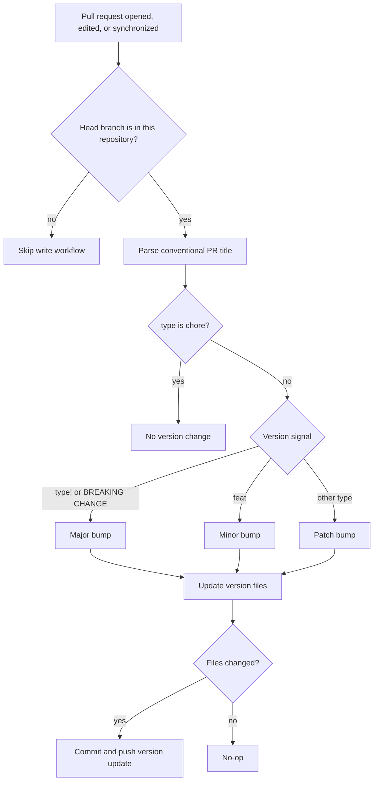

# Versioning and Release Automation

Forsetti uses Semantic Versioning (`MAJOR.MINOR.PATCH`) for framework version numbers.
Version updates are intentionally reviewable because the runtime version participates in manifest compatibility checks.

## Version Sources

The current framework version is stored in three tracked surfaces:

| Surface | Purpose |
| --- | --- |
| `version.txt` | Plain text version used by scripts and workflows. |
| `Sources/ForsettiCore/ForsettiVersion.swift` | Runtime value used by compatibility checks. |
| `README.md` | User-visible repository version marker. |

All three values must match. `.release-please-manifest.json` is release configuration state and is not changed by the PR version workflow.

## PR Version Workflow

`.github/workflows/pr-version.yml` runs on same-repository pull requests.
It reads the version from the target branch, calculates the next version from the PR title/body, updates the framework version files, and pushes a version commit back to the PR branch when needed.



## Bump Rules

| PR signal | Bump | Example |
| --- | --- | --- |
| Breaking change marker | Major | `feat!: replace manifest schema` |
| Feature | Minor | `feat: add module provider registry` |
| Fix, docs, refactor, test, CI, build, style, performance | Patch | `docs: expand lifecycle guide` |
| Repository chore | None | `chore: rotate workflow labels` |

The workflow uses the same supported title types as `lint-pr.yml`. It treats `chore:` as an explicit statement that the PR should not represent a framework version change. Chore PRs fail the workflow if version files already differ from the target branch.

## Release Handoff

The PR version workflow is responsible only for keeping framework version files aligned before merge.
Release publication, changelog maintenance, tags, and GitHub releases are handled as separate post-merge release work.

## Local Validation

Run these commands before publishing version or release workflow changes:

```bash
python3 -m py_compile Scripts/update-pr-version.py
swift test --parallel --enable-code-coverage
swiftlint lint --strict --config .swiftlint.yml
./Scripts/verify-forsetti-guardrails.sh
```

For a script-only smoke test:

```bash
tmpdir="$(mktemp -d)"
cp -R version.txt README.md Sources "$tmpdir/"
(
  cd "$tmpdir"
  python3 "$OLDPWD/Scripts/update-pr-version.py" \
    --base-version 0.1.0 \
    --title "feat: add runtime feature"
)
```

The copied files should update to `0.2.0`.
